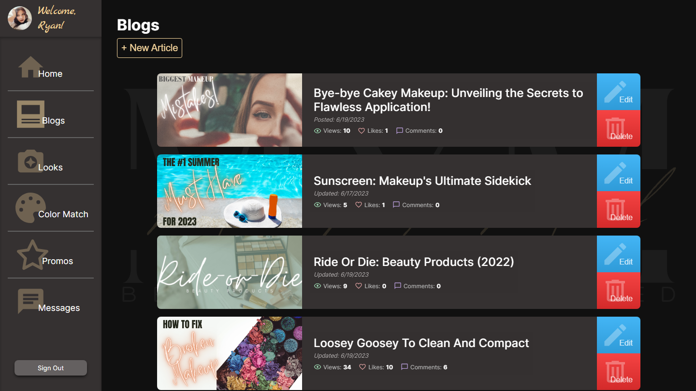
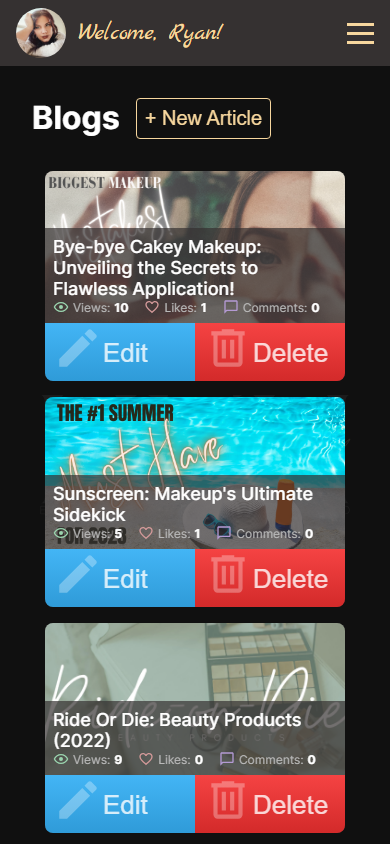
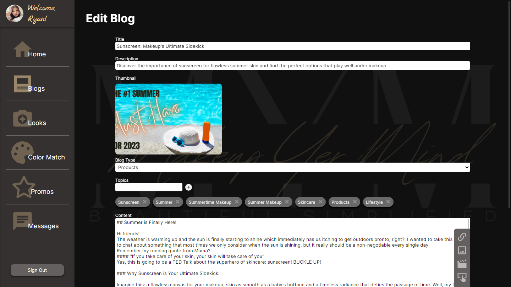
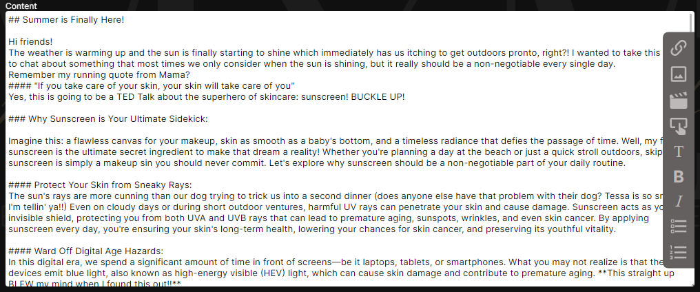
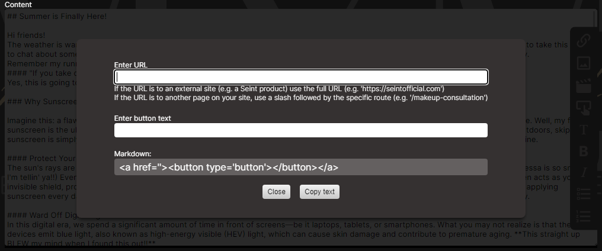
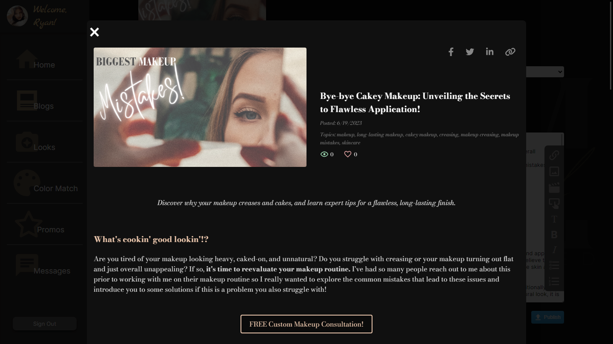
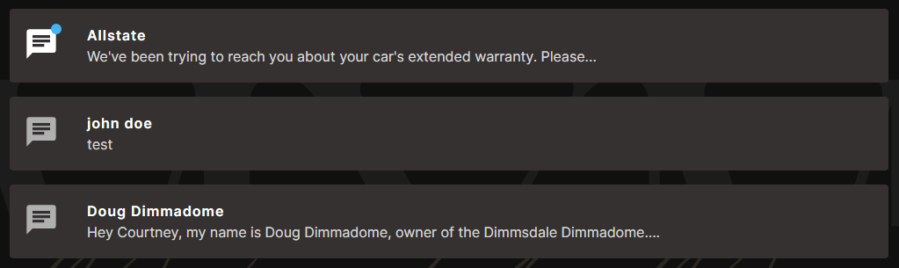

# Content Management System - Makeup Yer Mind

This custom-built content management system was designed specifically for a client website, [Makeup Yer Mind](https://makeupyermind.com). In addition to giving my client the ability to directly create, edit, and manage their content through this service, it also generated new content ideas for the client and helped to organize and streamline their content-delivery process.

This system's main feature is a purpose-built markdown editor with support for implementing custom React Components using pre-generated HTML.

## Table of Contents

- [Overview](#overview)
    - [Using This System](#using-this-system)
    - [Screenshots](#screenshots)
    - [Requirements](#requirements)
    - [Site Layout](#site-layout)
- [The Process](#the-process)
    - [Blogs and Related Content](#blogs-and-related-content)
    - [Markdown Editor](#markdown-editor)
    - [Markdown Previewer](#markdown-previewer)
    - [Messages](#messages)
    - [Data Management](#data-management)
- [Continued Improvement](#continued-improvement)
- [Author](#author)

## Overview

### Using This System

You can find a demonstration version of this system [here.](https://mym-dev-53d22.web.app/)

This site is being demonstrated with the permission of the client, and all sensitive information has been removed.

**The demo version is hosted on a development server and will not affect the production version of the website.**

If you'd like to experiment with this system, the first thing you'll notice is that it is protected by user authentication. You can use Google authentication if desired, or you can use a sample login by using the following credentials:

- Email: makeupyermindcms@email.com
- Password: Pa$$word

Again, the demo version is connected to a development server with a separate database than the production version, so no edits will be visible on the production site.

### Screenshots

#### Blogs List - Desktop

#### Blogs List - Mobile

### Requirements

After finalizing media types required by the client I designed the system to handle two major functions:

- Create, read, update, and delete all forms of content to the blog site
- Receive and handle communications from the blog site

The types of media that can be pushed to the blog site are as follows:

- Blog articles
- 'Looks to try'
- Promotions

All of the above content types require a markdown-style editor that can handle site-specific styling and formatting, along with a preview function to ensure content looks exactly as the client intends.

Communications from the site from various users come in two forms:

- Simple messages
- Makeup consultation request forms

The system is also protected with user authentication via Firebase's authentication system and Firestore access policies, which will protect all content from unauthorized editing unless the user is logged in with specified credentials.

### Site Layout

The system is laid out as a simple React Router application. The home page is a simple welcome message, and a permanently-placed navbar directs the user to one of several routes: blogs, looks, promotions, consultation requests, and messages. Each of these routes displays a list of active articles/messages that can then be selected to route the user to the specific article or message for editing or viewing, respectively.

## The Process

### Blogs and Related Content

The three major content types (Blogs, Looks, and Promotions) are built in a very similar manner. Each of the three utilize a custom Form component which exposes Title, Description and Content inputs as well as media controls, such as saving as draft, publishing, and deleting the article. The Form component also renders any children components, which allows modularity in the content types. Blogs will render an image input, a field for multiple topics, and a 'type' property for filtering blogs on the blog site. Looks render two image inputs, a 'tags' input, and a 'color-picker' which allows the client to select all makeup products used to create the look. Promotional content allows for an expiration date to be set, after which it will be marked as inactive on the blog site.

An example of the editing form for a blog is given below:

While editing these content types, state is managed via a call to useReducer to manage the complexity and density. This was chosen over useState because of the lower complexity in the front-facing code, despite the higher initial setup. It also provides easier troubleshooting and maintenance with fewer points of failure or codependency.

### Markdown Editor

The markdown editor component, or 'Content' component, is a highly-specialized editor utilizing multiple sub-components to provide a very user-friendly approach to editing markdown. At its core, it's essentially a textarea element extended with state-managed components for markdown insertion. The editor is enhanced with a toolbar to simplify the editing process and automatically insert special components used on the main site. The client wished to embed not only text and images, but custom buttons, links, and videos, which required the use of custom HTML.

When a heading, italic text, list, or a special component is needed, the user can select the desired action from the toolbar which will render a modal to assist in generating the necessary markdown. Prompts are given to ensure text is added to the correct area, and any special instructions are given (such as for link URLs). The generated markdown is given as a preview and can be copied to the clipboard by clicking the supplied button.

### Markdown Previewer

Working in concert with the editor, each article's content can be previewed with the same styling as the blog site to ensure the article meets the client's design intention and standards. This is accomplished by processing the article's state with a React-Markdown component to parse all markdown. Since the editor is extended with raw HTML insertion to handle various media, the React-Markdown component is extended with Rehype to allow parsing of raw HTML. Since the only users able to edit markdown content are Firebase-authenticated users, this plugin will not pose a risk to foreign data entry to the database.

### Messages

In order to simplify contact from site visitors and those requesting a consultation, the system was designed to receive those requests and organize them similarly to media types. Messages and consultation requests are both displayed with a status indicator to inform the user of whether the message has been read, and each message is automatically marked as read upon viewing. The message can be marked as unread if desired. Consultation requests can be marked as fulfilled to help the user organize their requests.

### Data Management

All data utilized on this system is directly interfaced with the blog site, which is hosted on a different platform but uses the same Firebase Firestore database. It was therefore designed not only to provide ease of editing and saving but also to provide better user experience and autonomy for the main blog site.

The individual data types are managed by Typescript types used throughout the application. An example of the Blog type is given below:

~~~
type Blog = {
    id: string,
    comments: number,
    title: string,
    slug: string,
    topics: string[],
    author: string,
    likes: number,
    createdAt?: FieldValue,
    updatedAt?: FieldValue,
    views: number,
    image: string,
    content: string,
    description: string,
    draft: boolean,
    type: 'products' | 'tutorial' | 'lifestyle' | 'state-of-mind',
    docType: 'blog'
}
~~~

These types are also used to validate the data when fetched from the database for editing/viewing, as below:

~~~
export const dataIsBlog = (data: DocumentData): data is Blog => {
    return data.docType === 'blog'
}
~~~

When fetching data from Firestore, each document is validated before being placed in a new array of data and returned to the application. This ensures that information being saved to Firestore both on this system and the main blog site can be ensured to be valid data and have all required fields.

This system utilizes the React Context API to manage global state and expose simplified methods for getting, updating, and refreshing data throughout the user's use of the application. The context abstracts much of these processes and supplies simple functions such as loadBlogs(), saveBlog(), saveDraft(), etc. A separate Context is used for authentication outside of the Data Context to ensure data is only fetched if a user is authenticated. Firestore security rules ensure content can only be updated or deleted if the user's ID is within a specified subset of IDs, ensuring unwanted users cannot interfere with site content.

## Continued Improvement

Although this site is operational, there are several planned upgrades for the future. Among these is a feature to set a 'delayed release' to Blog articles to allow for a more rigorous release schedule. I plan to implement this similarly to how Promotions are flagged with an expiration date, in that a release date set in the future will prevent the article from being displayed on the blog site until that date is reached. After that point, the article will be flagged as 'active' and displayed along with every other article.

Additionally, since the color samples used in the 'Looks to Try' articles are saved separately in the database and do not have their own editing feature in this system, I plan on adding the ability for users to update color samples on their own via this system.

## Author

- Visit my portfolio - [ryanbradleyportfolio.com](https://ryanbradleyportfolio.com)
- Contact me for your next website - [ryanbradleywebdev.com](https://ryanbradleywebdev.com)
- Email me - [ryan@ryanbradleywebdev.com](ryan@ryanbradleywebdev.com)
- Follow my Instagram - [@ryanbradley_web_dev](https://www.instagram.com/ryanbradley_web_dev/)